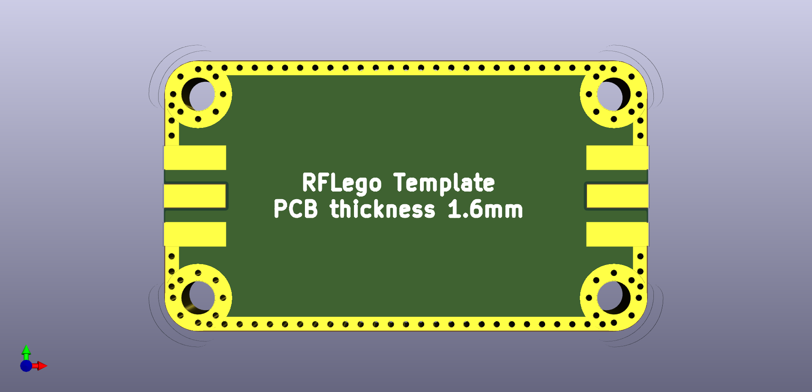

# RFLego
[](https://github.com/fgaletsee/RFLego/actions?query=workflow%3A%22Create+Gerber+Files%22)

Collection of many different RF components which can be combined, like Lego.

All modules are based on a 18mm x 32mm form factor as seen below.




## Generate Gerber Files

```bash
make
```
